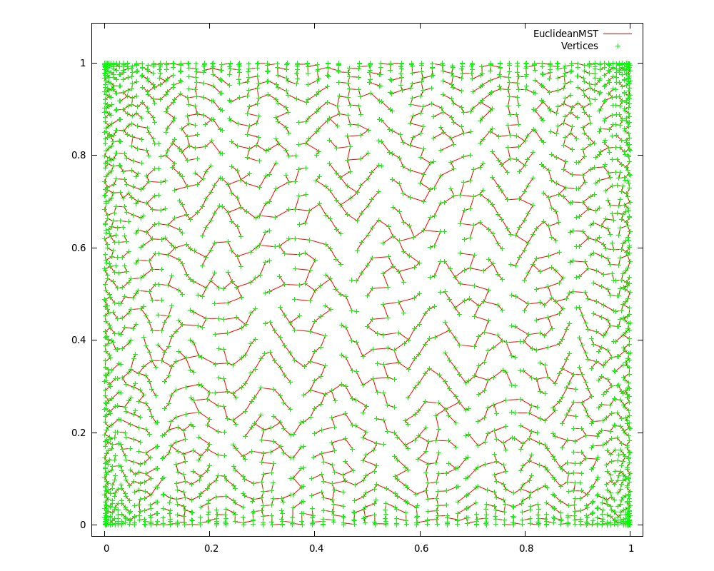

`euclideanmst.js`
===============

Simple implementation of a Euclidean Minimum Spanning Tree algorithm.

[Euclidean Minimum Spanning Tree](http://en.wikipedia.org/wiki/Euclidean_minimum_spanning_tree)

Install
=====

    npm install euclideanmst

Usage
=====

Here is an example of finding the minimum spanning three given in the example directory:

See 'example/example.js' for a full example.  Here is an abridged version:

    // Generate an example 'random enough' sequence
    //
    var n = 3000;
    var verts = [];
    for (var i=0; i<n; i++)
    {
      var a = 123.12315;
      var b = 7788.1231;
      var p = [ (Math.cos( a*(i+1) ) + 1.0)/2.0, (Math.cos( b*(i+1) ) + 1.0)/2.0 ];
      verts.push(p);
    }

    function distance_metric(a,b) 
    {
      return (a[0]-b[0])*(a[0]-b[0]) + (a[1]-b[1])*(a[1]-b[1]); 
    }

    var EuclideanMST = require("../euclideanmst.js");
    var edges = EuclideanMST.euclideanMST( verts, distance_metric  );

    printEdge( verts, edges );

License
=======
GPLv3
